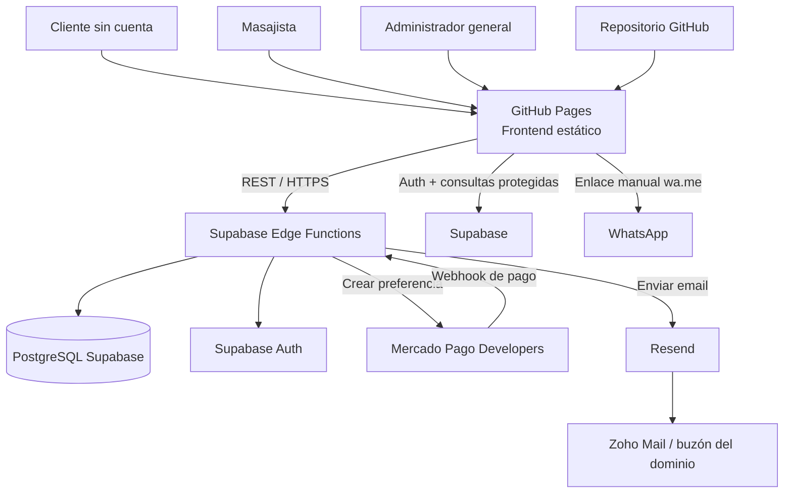
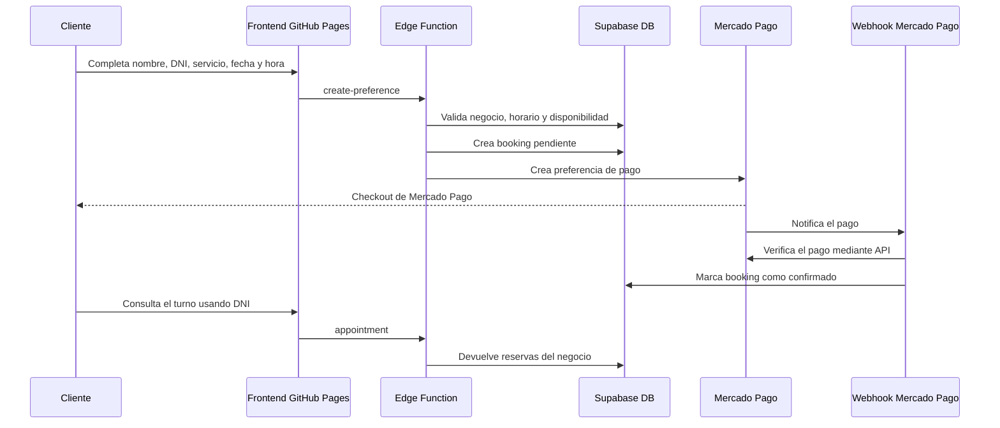
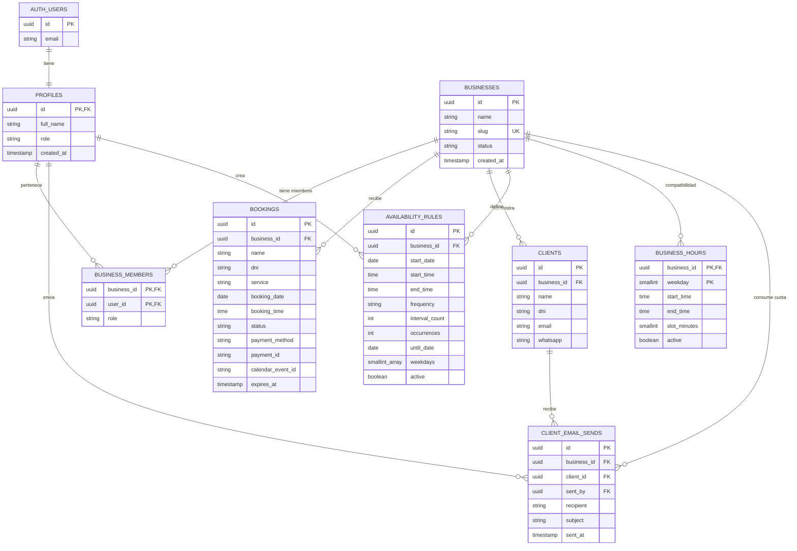

# Induliru · Plataforma de reservas para profesionales

Aplicación web multi-negocio para que cada profesional pueda publicar sus horarios, recibir reservas online, cobrar con Mercado Pago y administrar turnos, clientes y facturación.

La plataforma permite que el administrador general cree negocios y asigne profesionales.

## Estado actual

- Frontend estático publicado en GitHub Pages.
- Supabase funciona como backend, autenticación y base de datos.
- Las reservas y los horarios reales viven en Supabase.
- Mercado Pago crea preferencias de pago y confirma pagos mediante webhook.
- Resend envía emails desde el panel de clientes, con un límite de 30 envíos mensuales por negocio.
- WhatsApp funciona actualmente mediante enlaces `wa.me` con mensajes o conversaciones manuales.
- Google Calendar tiene código de integración legado/preparado, pero no es actualmente la fuente oficial de disponibilidad ni de reservas.

## Arquitectura general



### Flujo de una reserva



## Diagrama entidad-relación de la base de datos



### Consideraciones del modelo

- `businesses` representa cada negocio o masajista dentro de la plataforma.
- `business_members` vincula usuarios administrativos con negocios.
- `profiles.role` puede ser `platform_owner`, `admin` o `client`.
- Los clientes finales no necesitan cuenta de Supabase: se identifican por nombre y DNI.
- `bookings` conserva el DNI como dato de la reserva. La relación lógica con `clients` es `business_id + dni`; actualmente no hay una FK directa entre ambas tablas.
- `availability_rules` es la tabla principal del editor moderno de horarios.
- `business_hours` se conserva por compatibilidad con el modelo inicial.
- `client_email_sends` registra los envíos para aplicar la cuota mensual por negocio.

## Frontend

El frontend está hecho con HTML, CSS y JavaScript vanilla. No usa React, Vue, Angular ni un bundler.

### Dónde está

- Código fuente: raíz del repositorio.
- Publicación: GitHub Pages.
- URL pública: `https://induliru.com/turnos/`
- Reserva pública: `/`
- Panel de profesionales: `/admin/`
- Panel del administrador general: `/adminadmin/`
- Confirmación de pago: `/exito.html`

### Archivos principales

| Archivo | Responsabilidad |
|---|---|
| `index.html` | Página pública de reserva y consulta de turnos. |
| `script.js` | Validaciones, disponibilidad, pago, consulta y cancelación. |
| `styles.css` | Estilos globales y responsive. |
| `admin.html` | Interfaz compartida de los paneles administrativos. |
| `admin.js` | Login, roles, calendarios, negocios, clientes, facturación y emails. |
| `admin/index.html` | Wrapper de `/admin/`. |
| `adminadmin/index.html` | Wrapper de `/adminadmin/`. |
| `exito.html` | Página posterior al checkout. |
| `supabase-config.js` | URL y clave pública de Supabase. |
| `calendar-api.js` | Integración antigua/preparada con Google Calendar. |
| `calendar-config.js` | Configuración antigua de Google Calendar. |
| `env-loader.js` | Cargador de configuración del frontend legado. |

### Rutas y roles

| Ruta | Usuario esperado | Función |
|---|---|---|
| `/admin/` | `admin` | Gestionar el negocio asignado. |
| `/adminadmin/` | `platform_owner` | Crear y revisar negocios/masajistas. |

El frontend valida el rol después del login. Si el rol no corresponde a la ruta, cierra la sesión y no muestra ningún panel.

## Backend

El backend no está en un servidor Node tradicional. Está implementado con Supabase:

- Supabase Auth administra usuarios y sesiones.
- PostgreSQL almacena reservas, negocios, perfiles, clientes y horarios.
- Row Level Security —RLS— limita el acceso por rol y negocio.
- Supabase Edge Functions contienen la lógica que necesita secretos o validaciones server-side.
- Las migraciones SQL reproducen la estructura completa de la base.

### Dónde está

- Proyecto Supabase configurado en `supabase/config.toml`.
- Migraciones: `supabase/migrations/`.
- Edge Functions: `supabase/functions/`.
- Configuración de funciones: `supabase/config.toml`.

### Edge Functions

| Función | Uso |
|---|---|
| `availability` | Calcula horarios disponibles para una fecha y negocio. |
| `appointment` | Consulta reservas por DNI. |
| `create-booking` | Crea reservas desde el flujo público. |
| `create-preference` | Valida el turno y crea la preferencia de Mercado Pago. |
| `mercadopago-webhook` | Verifica pagos y confirma reservas. |
| `cancel-booking` | Cancela una reserva validando DNI y negocio. |
| `create-business-admin` | Crea usuario profesional, negocio y membresía. Solo `platform_owner`. |
| `send-client-email` | Envía email mediante Resend y controla la cuota mensual. |

## Lenguajes y tecnologías

### HTML5

Define la estructura de páginas públicas y administrativas: formularios, tablas, modales, calendarios y navegación.

### CSS3

Define apariencia visual, responsive design, paleta pastel, modo oscuro, estados de botones y layout de calendarios/tablas.

### JavaScript vanilla

Se ejecuta en el navegador y controla la interacción del frontend: validaciones, Edge Functions, estados, FullCalendar, Flatpickr y sesiones de Supabase Auth.

### TypeScript sobre Deno

Las Edge Functions están escritas en TypeScript y se ejecutan en Deno. TypeScript aporta tipos y estructura para la lógica del backend.

### SQL / PostgreSQL

Las migraciones están escritas en SQL y se ejecutan sobre PostgreSQL. Allí viven tablas, índices, restricciones, triggers, funciones y políticas RLS.

### Mermaid

Se utiliza dentro de este README para documentar arquitectura y relaciones de datos.

## Plataformas y servicios externos

### GitHub / GitHub Pages

GitHub aloja el repositorio y el historial de código. GitHub Pages publica el frontend estático a partir de la rama `main`.

### GitHub Projects

Puede utilizarse para organizar tareas, bugs y roadmap. No ejecuta lógica ni almacena reservas.

### Supabase

Es el backend principal: Auth, PostgreSQL, RLS, Edge Functions y secretos de servidor.

### Mercado Pago Developers

- `create-preference` crea el checkout.
- Mercado Pago procesa el pago.
- `mercadopago-webhook` consulta la API y actualiza `bookings`.
- El pago confirmado se representa con `payment_method = 'mercadopago'`.

### Resend

- Envía emails desde `hola@induliru.com`.
- La API key vive como secreto de Supabase, nunca en el frontend.
- `send-client-email` registra cada envío en `client_email_sends`.
- El límite actual es de 30 emails mensuales por negocio.
- El dominio `induliru.com` debe permanecer verificado mediante DNS.

### Zoho Mail

Zoho aloja el buzón del dominio y permite recibir/administrar mensajes. Resend es el servicio que realiza los envíos transaccionales.

### WhatsApp

Actualmente se utiliza `https://wa.me/...` para abrir conversaciones manuales. Todavía no hay integración con WhatsApp Business Cloud API ni envíos automáticos server-side.

### Google Calendar

Hay archivos frontend de integración (`calendar-api.js` y `calendar-config.js`), pero la arquitectura actual no depende de Google Calendar para decidir disponibilidad. Supabase es la fuente oficial. Una futura integración debería ejecutarse desde backend como proyección/webhook.

## Seguridad

- La `anon key` de Supabase puede estar en el frontend; no es una clave administrativa.
- Nunca publicar `service_role`, `SUPABASE_SECRET_KEYS`, `MERCADOPAGO_ACCESS_TOKEN`, `RESEND_API_KEY` ni credenciales de Google.
- Los secretos se guardan en Supabase Functions Secrets.
- Las reservas públicas no escriben directamente en tablas administrativas: pasan por Edge Functions.
- Las funciones server-side validan negocio, horario, DNI, sesión y permisos.
- RLS separa los datos por `business_id`.
- `platform_owner` es el rol global de la plataforma y administra negocios desde `/adminadmin/`.
- Los profesionales normales deben tener una fila en `business_members` para acceder a su negocio.

## Migraciones

Las migraciones se ejecutan en orden con:

```bash
supabase db push
```

| Migración | Función |
|---|---|
| `20260808000000_create_bookings.sql` | Reservas base, estados, expiración e índices. |
| `20260809000000_add_profiles_and_business_hours.sql` | Perfiles, roles iniciales y horarios heredados. |
| `20260809000001_add_multi_business_model.sql` | Negocios, membresías y `platform_owner`. |
| `20260809000003_add_availability_rules.sql` | Horarios únicos y recurrentes. |
| `20260809000004_add_booking_payment_source.sql` | Origen de pago y RLS administrativo. |
| `20260809000005_add_pending_payment_source.sql` | Estado de pago pendiente. |
| `20260809000006_add_clients.sql` | Clientes por negocio. |
| `20260809000007_manage_clients.sql` | Eliminación segura de clientes sin reservas. |
| `20260809000008_add_client_contact_data.sql` | Email y WhatsApp de clientes. |
| `20260809000009_track_client_emails.sql` | Registro de envíos y cuota de Resend. |

## Desarrollo y despliegue

### Requisitos

- Git.
- Supabase CLI autenticado.
- Proyecto Supabase.
- Servidor HTTP local para probar el frontend; no abrir los HTML con `file://`.

### Frontend local

Desde la raíz del proyecto:

```bash
python3 -m http.server 8000
```

Abrir `http://localhost:8000/`.

### Base de datos

```bash
supabase db push
```

### Desplegar una Edge Function

```bash
supabase functions deploy nombre-de-la-funcion
```

### Secretos

Ejemplo de nombres utilizados por el backend:

```bash
supabase secrets set RESEND_API_KEY=re_...
supabase secrets set MERCADOPAGO_ACCESS_TOKEN=...
```

No guardar valores reales en el repositorio ni en este README.

## Próximos pasos

- Agregar email y WhatsApp al formulario público de reserva.
- Automatizar confirmaciones y recordatorios por email.
- Integrar WhatsApp Business API si se necesitan envíos automáticos.
- Implementar la proyección server-side hacia Google Calendar.
- Hacer configurables los precios por negocio.
- Incorporar auditoría y métricas más completas para el administrador general.

---

Desarrollado para Induliru.tech.
